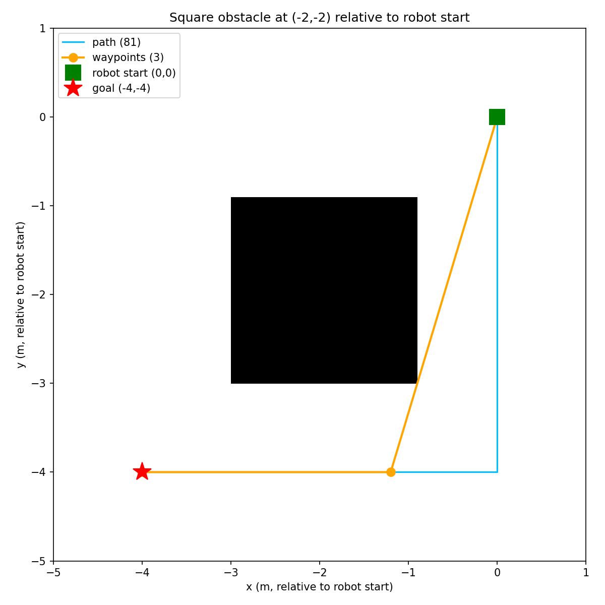

### 1. Path and Motion Planning
#### Motion planning as done in the assignments -> attraction based
Potential field planner from the assignments, ported as-is and wrapped into a python class for ease of use.

#### Flood fill with line of sight
Global planner on top, for large maps where a single potential field goal gets stuck:
1. **Flood fill**: BFS from the goal gives every free cell a distance-to-goal value.
2. **Greedy descent**: from the start, always step to the neighbor closer to the goal -> full grid path.
3. **Waypoint reduction**: If full path is `p0 -> p1 -> p2 -> p3 -> p4 -> ...`. If `p0` can see `p4` in a straight line (no occupied cells), skip `p1`-`p3` and go straight `p0 -> p4`. Repeat from there. Diagonal cuts are blocked if either corner cell is occupied - that's a pinch point robot may not fits through, so the path takes the L-shape detour instead.

These waypoints feed one at a time into the potential field planner.

### First path and motion planning validation

Quick end-to-end validation before continuing: the planned path/waypoints (left) next to the actual robot driving them in Gazebo (right). Note the robot's position at controller start is treated as (0,0) with heading 0, so there's a slight offset/flip relative to the planning image, but it drives the waypoints correctly regardless - some fine-tuning likely still needed.

