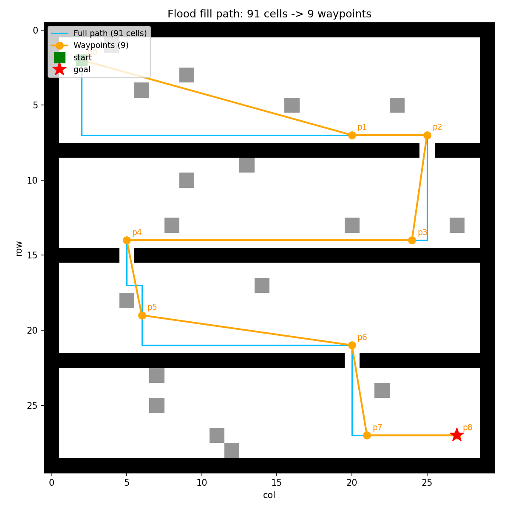
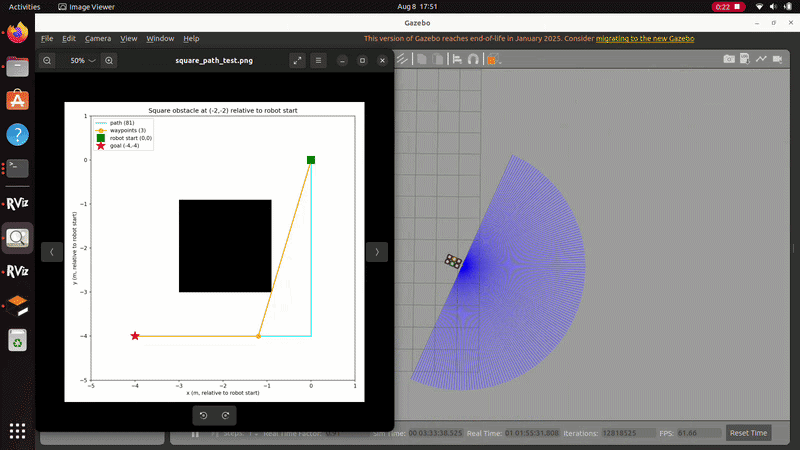
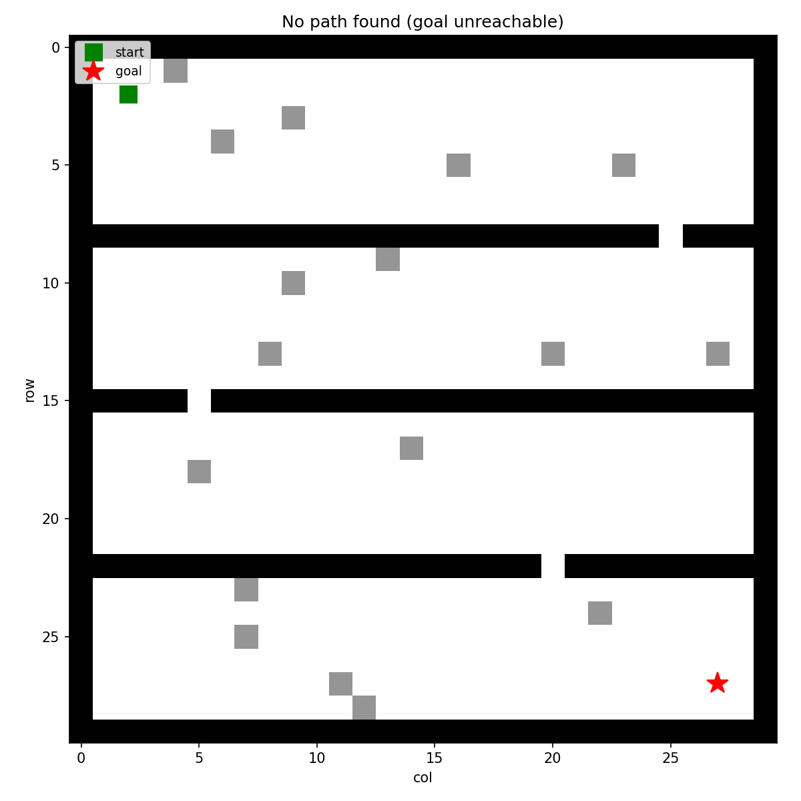

### 1. Path and Motion Planning
#### Motion planning as done in the assignments -> attraction based
Potential field planner from the assignments, ported as-is and wrapped into a python class for ease of use.
#### Flood fill with line of sight
Global planner on top, for large maps where a single potential field goal gets stuck:
1. **Flood fill**: BFS from the goal gives every free cell a distance-to-goal value.
2. **Greedy descent**: from the start, always step to the neighbor closer to the goal -> full grid path.
3. **Waypoint reduction**: If full path is `p0 -> p1 -> p2 -> p3 -> p4 -> ...`. If `p0` can see `p4` in a straight line (no occupied cells), skip `p1`-`p3` and go straight `p0 -> p4`. Repeat from there. Diagonal cuts are blocked if either corner cell is occupied - that's a pinch point robot may not fits through, so the path takes the L-shape detour instead.
These waypoints feed one at a time into the potential field planner.

### First path and motion planning validation
Quick end-to-end validation before continuing: the planned path/waypoints (left) next to the actual robot driving them in Gazebo (right). Note the robot's position at controller start is treated as (0,0) with heading 0, so there's a slight offset/flip relative to the planning image, but it drives the waypoints correctly regardless - some fine-tuning likely still needed.  

Note: for this square obstacle it looks like the path pinches the corner, but it actually just barely misses it. In real application the potential field planner takes care of the fine-grained corner avoidance, since the waypoint only marks the rough direction to head in.

> **Subject to change**: one thing still to be added: a minimum number of free grid squares to be considered passable for the robot when planning the path (a single free cell might not be enough clearance given the robot's actual size). Easiest fix here is to group occupancy cells together into robot-sized chunks before running flood fill. Currently this is not addressed due to the fact that we dont have propper map building yet for further testing. Only the prof of concept testing.

### Obstacle Inflation (Configuration Space / C-Space)

To prevent the robot from getting stuck on corners or choosing passages it cannot physically fit through, **obstacle inflation** has been integrated into the global planner. This solves the issue of treating the robot as a point mass during planning, allowing it to be considered with its actual physical dimensions instead.

* **How it works:** The map is pre-processed before the flood-fill algorithm is executed. Every grid cell marked as an obstacle is artificially "inflated" by a defined radius. By calculating the Euclidean distance, a circular buffer is created around the obstacles. The planner then searches for its path within this safe Configuration Space (C-Space).
* **Configuration:** The safety margin can be configured during the initialization of the `FloodFillPlanner` using the `inflation_radius_cells` parameter. Given a grid resolution of 0.1 m per cell, a value of `3` corresponds to a 30 cm buffer, which serves as a solid default for the Robile.

*Figure: The planner correctly identifies that the goal is unreachable because the narrow gaps in the walls (1 cell) are completely closed off by the robot's inflation radius (3 cells) in the Configuration Space.*